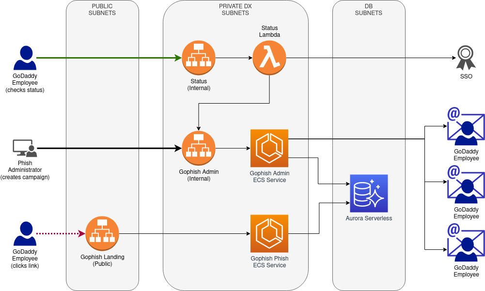

# PhishFramework Architecture

The [Gophish](https://getgophish.com/) software exposes two primary services:

* An administrative webserver, where a Gophish administrator:
  - Creates and manages campaigns (causing phishing emails to be sent)
  - Views metrics
* A phish webserver that:
  - Serves arbitrary phishing sites
  - Records which users have visited the phishing sites

### Gophish Services

The infrastructure configured by the GoDaddy PhishFramework consists of three
different services:

| Service                             | Type               | Auth             | URL (Dev-Private)                        |
|-------------------------------------|--------------------|------------------|------------------------------------------|
| [Gophish Admin](#gophish-admin)     | Private (Internal) | Gophish built-in | https://admin.phish.int.dev-gdcorp.tools |
| [Gophish Landing](#gophish-landing) | Public (External)  | None             | https://okta.gocladdy.com (varies)       |
| [Gophish Status](#gophish-status)   | Private (Internal) | SSO JWT          | https://phish.int.dev-gdcorp.tools       |

### AWS Components

### Gophish Admin

The **Gophish Admin** service provides the administrative interface that
Gophish administrators can use to manage the system.  It provides a dashboard
that allows the Gophish administrator to configure all aspects of the Gophish
framework, including campaigns, users, templates, landing pages, and profiles.
It is implemented using a private application load balancer that forwards
traffic to the `admin` service provided by the Gophish application.  The
Gophish application runs as a Fargate task (named `gophish`) using the
[gophish](../containers/gophish/) container image.  The container reads
parameters at startup to determine the MySQL endpoint that should be used.

### Gophish Landing

The **Gophish Landing** service provides a webserver that presents the phishing
sites that the user targets are directed to.  It records the users that visit
each phishing site in the MySQL database for subsequent reporting.  It is
implemented using a public application load balancer that forwards traffic to
the `phish` service provided by the Gophish application.  The Gophish
application runs as a Fargate task (named `landing`) using the
[gophish](../containers/gophish/) container image.  The container reads
parameters at startup to determine the MySQL endpoint that should be used.

### Gophish Status

The **Gophish Status** service provides a simple status page for users who have
authenticated using SSO and present a valid JWT.  It is implemented using a
private application load balancer that forwards traffic to a Python lambda
function.  The lambda function checks for the presence of a valid Jomax JWT.
If a valid JWT is not present, the user is redirected to the SSO login page.
Otherwise, an API call is made to the *Gophish Admin* service to query both
active and archived campaigns.  The summarized campaign information is
presented to the caller via a simple HTML table.  At present, the user is not
able to interact with the Gophish service in any way other than a read-only
retrieval of campaign statistics.
